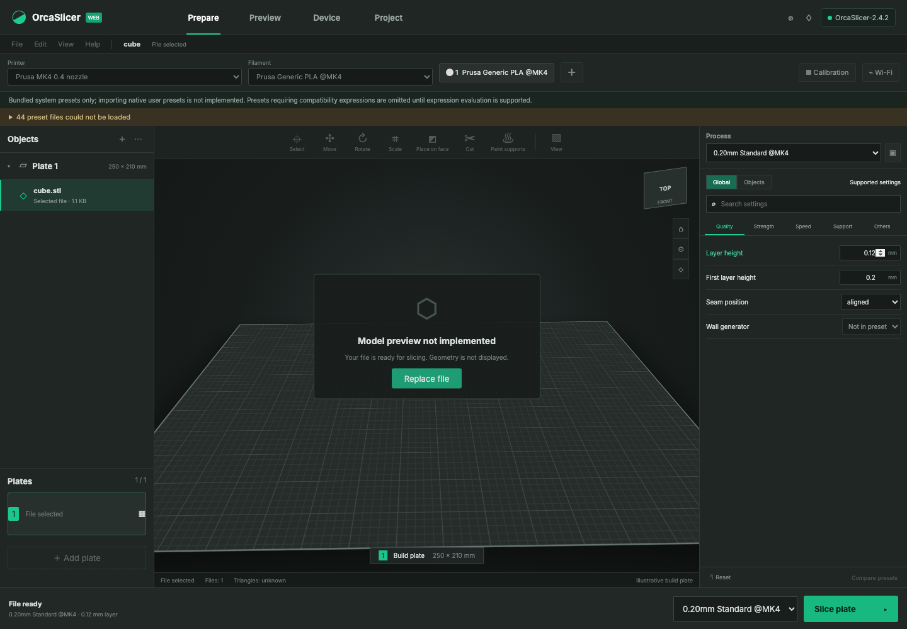
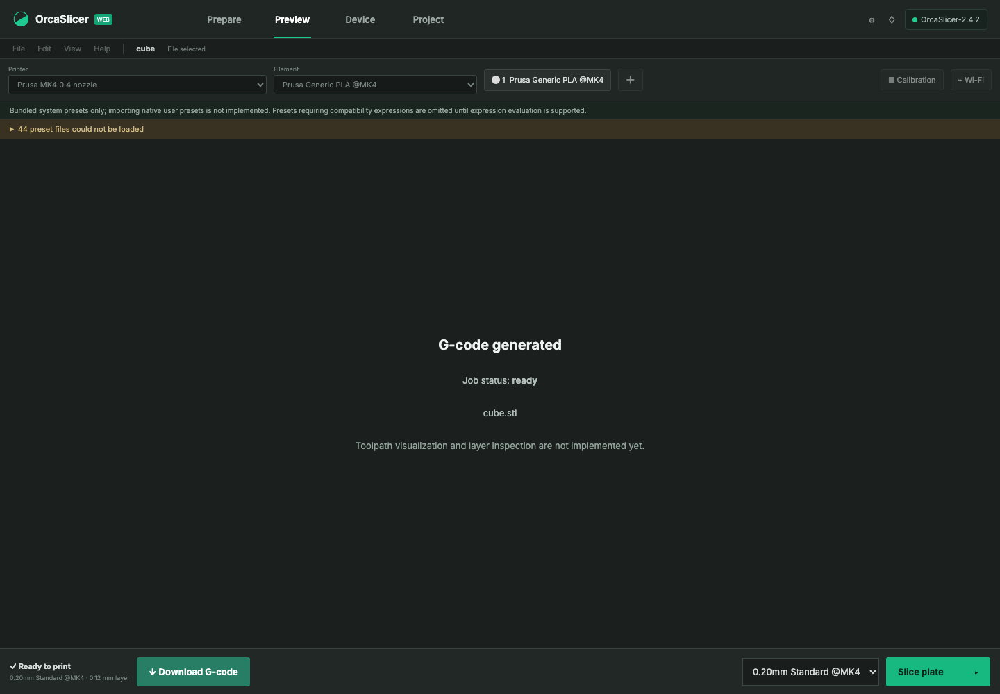

# Milestone 01: working native slicing and durable parity tracking

Recorded 2026-09-26, America/Los_Angeles. Repository base: `5050dab`; implementation: the uncommitted `milestone-01` working tree delivered with this report. Reference engine: locally installed **OrcaSlicer 2.4.2 on macOS**. This milestone establishes a working foundation; it does not establish complete UI or feature parity.

## Exported inventory

`features.json` tracks 102 major feature areas with stable IDs, priorities, statuses, acceptance criteria, test plans, existing test references, evidence, and change history. `features.csv` and `PROGRESS.md` are generated exports. Missing functionality has test plans, not passing placeholder tests. The tracker validator rejects unsupported verification claims, duplicate IDs, invalid statuses, and nonexistent test references. `AGENTS.md` requires future implementation work to update this record.

`native-settings.json` and `native-settings.csv` list 881 observed category/key pairs in bundled system preset files: 222 machine, 431 process, and 228 filament. Nineteen process keys have editable web controls. This is a union of declared preset keys, not an exhaustive native GUI schema or a percentage of parity. The export contains key names/types and provenance, not native user account data or preset values.

## Implemented behavior

- The server preserves model extensions and resolves complete bundled printer, process, and filament configurations, including inheritance. The selected presets and validated overrides reach the real native executable.
- Browser preset selectors share one selection, load compatible choices, display supported preset values, and reset explicit overrides. Numeric, percentage, boolean, and enum values use native representations. Pending or stale preset requests cannot enable slicing with mismatched settings. Editing inputs invalidates old download results.
- Each job uses isolated model, configuration, output, and native data directories. The adapter drains bounded diagnostics, enforces timeouts, supports internal cancellation, and rejects missing, empty, or multiple G-code outputs. A serial queue prevents overlapping production runs.
- Job index writes are serialized and atomically replaced. Failed writes preserve the previous in-memory and on-disk state. Restart marks interrupted queued/slicing jobs failed. Health reports executable availability and version observed at startup.
- Model and toolpath rendering remain unavailable. The previous fixed decorative cube and invented triangle count were removed. Unsupported workspaces and controls explain their limitations.

## Executed checks

All listed checks ran successfully against this milestone. None were skipped.

| Command | Result | Scope |
|---|---|---|
| `npm test` | 45 passed | Unit and HTTP tests: preset inheritance/compatibility, typed settings, upload validation, strict fake CLI contract, queue/output isolation, process termination, atomic persistence, recovery, and inventory validation/export |
| `npm run test:e2e` | 9 passed | Browser interactions with isolated fixture presets and a strict fake executable; includes stale requests, defaults, overrides/reset, failed jobs, and unavailable engines |
| `npm run test:native` | 5 passed | Installed real engine: STL baseline/overrides, watertight OBJ, native-exported single-plate 3MF, malformed STL rejection, and API/direct-CLI differential comparison |
| `npm run test:e2e:native` | 1 passed | Chromium upload → actual native preset selection → 0.12 mm override → real OrcaSlicer 2.4.2 → successful G-code download |
| `npm run build` | Passed | Production Vite build |
| `npm run parity:settings -- --profiles-dir /Applications/OrcaSlicer.app/Contents/Resources/profiles --native-version 2.4.2 --write` | Passed | 881 observed keys; no parse warnings; all 19 browser setting definitions found |

The API/CLI differential test independently constructs the reference CLI arguments, bypassing the web slicing adapter. Using the same twelve-triangle 20 mm cube, Prusa MK4 0.4 nozzle, 0.20 mm Standard @MK4 process, Prusa Generic PLA @MK4 filament, 0.16 mm layer override, and 70 mm/s outer-wall speed, **all 10,989 normalized G0/G1/G2/G3 motion commands match**. Comments and irrelevant whitespace are ignored. This is one fixture/preset combination; broader toolpath equivalence remains partial. It is not a byte-for-byte comparison, a GUI-generated project comparison, or a physical print test.

The real browser test checks the engine version, native preset identity, job metadata, actual extrusion commands, and emitted layer setting. The fake-engine browser suite cannot establish these properties by itself. Screenshots from the passing native browser test are preserved below.

## Remaining limits and next work

Full native UI layout, mesh rendering and transforms, multiple objects/plates, layer/toolpath visualization, project round trips, multimaterial, calibration, and device control remain unfinished. Native user presets and compatibility-expression evaluation are unsupported. The installed catalog exposes 968 printer choices and reports 44 invalid/incomplete inheritance chains; incompatible or unevaluated options are excluded. Some native built-in defaults are absent from preset JSON and display as unavailable rather than invented values. The current 19-control editor is only a small subset of native settings.

Store recovery is partial: tests cover interrupted job states and atomic replacement failures, but not sudden power loss, disk fsync durability, or abrupt-process fault injection. Crash leftovers in temporary work directories remain a cleanup task. Only one server may use a data directory. Health is a startup probe, and user-facing cancellation is not implemented. Docker configuration was adjusted for the shared settings module and explicit resources, but no Linux/container acceptance run is claimed.

The next implementation sequence is real mesh rendering and camera controls (`geometry.render`, `geometry.camera`), object/transform scene state, native project export/round trips, and toolpath/layer rendering. Each step should add its planned tests and update the same feature IDs. Expand the inventory whenever native inspection reveals untracked behavior. A 100% parity claim requires a complete agreed inventory and passing native acceptance across its full platform and hardware scope.

## Browser evidence

The screenshots below show the passing real-engine browser flow at a 1440 × 1000 viewport. They document functional progress, not visual parity with the native interface.

