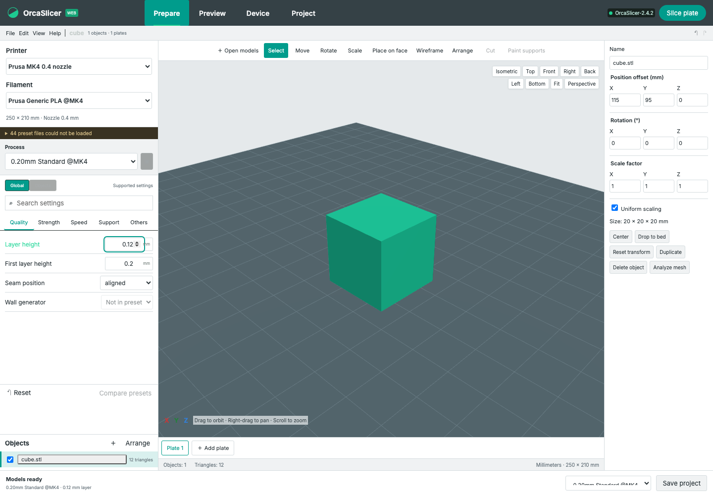
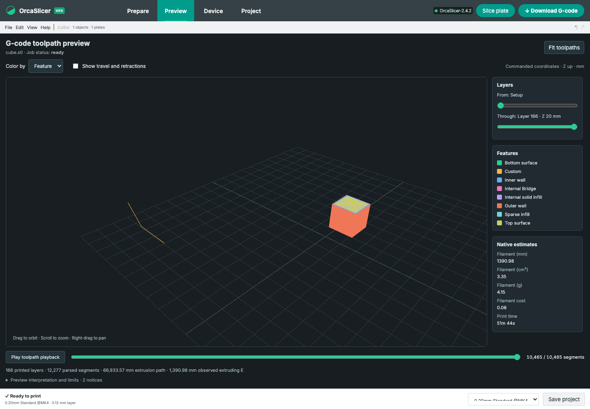

# Milestone 02: real geometry, toolpaths and web projects

Reference engine: installed **OrcaSlicer 2.4.2 on macOS**. Repository base: `5050dab`; implementation: the milestone-02 working tree. This records the completed M2 checks and excludes subsequent import/schema work. It establishes functioning editor and preview foundations, not complete native UI or feature parity. Historical M1 evidence remains in [MILESTONE_01.md](MILESTONE_01.md).

## Implemented behavior

Prepare now renders actual imported triangles in a selectable Three.js scene. Camera presets, perspective/orthographic views, numeric and gizmo transforms, independent duplication, deletion, face placement, bed placement and rectangular shelf arrangement operate on stored geometry. Multiple plates retain separate objects; slicing and exports use visible objects on the active plate. Preset bed outlines and dimensions inform the scene. Mesh inspection reports topology and dimensions but does not repair meshes.

STL and core 3MF exports contain transformed geometry. The slicing path preserves baked XY placement by disabling native automatic orientation/arrangement. Before submission, the complete active scene is lowered to the bed to agree with native Z placement. This is not certification of arbitrary floating-Z printing, irregular-bed nesting or sequential-print clearance.

Orca Web JSON save/load and local autosave preserve triangle assets, transforms, plates, preset IDs, process overrides, visibility, author and description. Core 3MF exports include metadata and a web-project JSON part. This own-format workflow does not import native 3MF painting, modifiers, material assignments or native project settings. Menus, a subset of shortcuts, light/dark themes and undo/redo now invoke working scene actions. Unavailable restored preset IDs remain visible and block slicing instead of silently selecting replacements.

Preview fetches the selected ready job's actual G-code and renders its moves. The parser supports linear moves, radius and center-offset arcs, alternate planes, helices, explicit absolute/relative positioning and extrusion, coordinate resets, feed rates, tools, native feature comments and layers. Controls expose layer ranges, feature/speed/tool colors, a legend, travel visibility, fit and segment playback. Native comment estimates are displayed only when present. Unknown positions and unsupported or invalid interpretations produce notices; parser limits prevent unbounded geometry. Firmware macros, machine kinematics and physical extrusion are not simulated.

User-facing cancellation handles queued and running jobs. Project history exposes retained outcomes, preview/download, cancellation and deletion. Startup cleanup removes recognized abandoned artifacts, preserves unrelated/ready files, avoids symlink traversal and stops when the job index is corrupt. Recovery still lacks abrupt-process/power-loss fault-injection acceptance and fsync durability guarantees; one server must own each data directory.

## Executed checks

The following integrated checks passed, with no skipped tests. Test counts are not feature verification counts.

| Command | Result | Scope |
|---|---|---|
| `npm test` | 85 passed | Geometry, loaders, project serialization, G-code parser, presets/settings, HTTP/lifecycle/storage and tracker tests |
| `npm run test:e2e` | 21 passed | Chromium editor/project/preview controls plus prior workflows; native slicing boundary uses a controlled fake engine |
| `npm run test:native` | 8 passed | Real native baseline, supported formats/rejection, API/direct-CLI comparison, transformed exports, multiple-object footprints and preserved XY |
| `npm run test:e2e:native` | 1 passed | Strict real 2.4.2 browser upload → preset/override → slice → actual G-code preview/download; rerun after the editor-state fixes |
| `npm run build` | Passed | Production Vite build |

Three additional editor regressions are included in the 21 browser checks: undo/redo restores printer-specific compatible preset choices without discarding history; an unavailable restored process preset remains unresolved and disables slicing; and New project invalidates an older unfinished model import. These checks do not cover every possible project-read or restoration race.

The real transformed-geometry fixture uses asymmetric scale `[1.5, 0.5, 0.75]`, a 90-degree Z rotation and translation. Exported STL and core 3MF both slice at the expected X55–65/Y55–85/Z0–15 mm footprint; **all 6,100 normalized motion commands match**. A second fixture preserves two arranged object footprints with 10 mm clearance. These tests complement the M1 10,989-command API/direct-CLI cube comparison; they do not establish arbitrary-model/native-GUI equivalence.

A separate scoped Chromium observation rendered retained real 2.4.2 cube output: 12,277 segments, 166 printed layers and eight feature labels, with one WebGL canvas and no page errors after color/travel/fit interactions. Native comments reported 51m44s, 1390.98 mm filament, 4.15 g and cost 0.08. Observed extruding E totaled 1390.98217 mm for that fixture. This is parser/rendering evidence, not a physical print or native screenshot-equivalence result.

## Tracker and remaining acceptance

The [102-unit inventory](features.json) now records **37 missing, 55 partial, 8 implemented and 2 verified** items. No additional whole feature was promoted to verified in M2. Only native invocation and supported-format generation retain that status. Every missing feature retains a test plan; passing fixture tests do not certify unimplemented native workflows.

M2 still exposes 19 editable process settings among 881 observed bundled preset category/key pairs. Full native defaults, expressions, visibility/scope rules and user presets remain incomplete. Native pixel parity, complete object/part hierarchy, painting, modifiers, advanced project round trips, all-plate slicing, calibration, multimaterial and device workflows remain outstanding. Broader accessibility, input/shortcut fidelity, polygon nesting, collision/clearance, G-code dialect and estimator comparisons need acceptance. Neither the inventory nor its verified count supports a defensible percentage of all native functionality.

## Browser evidence

These screenshots document the passing real-engine browser flow. They show functional progress and are not native visual-difference certification.

