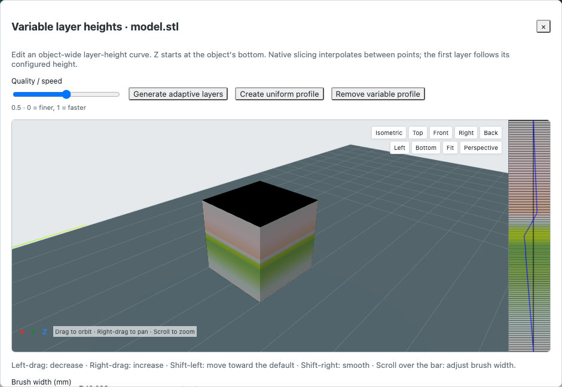

# Milestone 10 — native layer brush, painting view and PA patterns

Baseline: installed **OrcaSlicer 2.4.2**, source revision `8500fcdccaa10b5099ac20d252af3a7c560046f1`. Working tree extends repository revision `5050dab`. Full parity remains incomplete. No printer was contacted.

## Integrated behavior

- Manual variable-layer height bar implements decrease/increase, Shift reduce/smooth, held 100 ms repeat, native wheel width bounds, protected first/range heights, local stroke undo and project undo. Native palette, display layer schedule and two texture levels are generated from the pinned source algorithms. Original C++ reference profiles and full RGBA/LOD hashes are independent of the JavaScript implementation. See [VARIABLE_LAYERS.md](VARIABLE_LAYERS.md).
- Painting camera clipping ratio retains its plane through orbit and resets to the current camera direction. Closed caps and contours render without accepting paint hits. Circle, sphere and height cursors use actual world-space hits; hover leaves paint unchanged. See [painting view](../painting-view-and-inventory.md) and [cursors](../painting-cursors.md).
- Filament remapping updates native-group normal-part base assignments and painted states simultaneously, preserves other channels, supports pending Reset/applied Undo and exports compatible facet encodings. An independent native reference produces exactly 1,305 outer-wall segments and equal consumption for both filaments. See [filament remapping](../filament-remapping.md).
- PA patterns generate four source-defined layers around native handle cubes, with frame, chevrons, labels, retraction and native acceleration/PA commands. Up to four speeds by four accelerations are supported when complete footprints fit one rectangular bed. Both patterns and flow specimens download complete cached native 3MF bytes. Expired or changed sessions fail visibly, with no handle-only export fallback.
- Downloaded generated patterns retain a workflow binding on import. Browser and server reject geometry, settings, plates and script edits that would detach fixed absolute paths; selection and project names remain editable. This binding detects accidental edits and is not authentication of arbitrary Custom G-code. Ordinary custom commands keep their existing semantics. See [CALIBRATION.md](CALIBRATION.md).

## Executed checks

All final checks below passed with **zero skips**. Browser fixtures remain distinct from actual native engine evidence.

| Command | Result | Log |
|---|---:|---|
| `npm test` | 447 unit/API checks | `/private/tmp/orca-m16-unit.log` |
| `npm run build` | passed | `/private/tmp/orca-m16-build.log` |
| `npm run test:e2e` | 151 browser checks | `/private/tmp/orca-m16-browser.log` |
| `npm run test:native` | 80 installed-native checks | `/private/tmp/orca-m16-native.log` |
| `npm run test:e2e:native` | 13 browser/native checks | `/private/tmp/orca-m16-native-browser.log` |

Four native manual-brush cases compare complete motion streams to independent original-source profiles. Three native PA pattern cases produce 644, 2,281 and 2,578 generated moves; all four actual layers survive complete export, service import, validation and native re-slicing. The new browser/native PA pattern case verifies every effective command against independently compiled source, after actual browser download and re-import. Existing flow specimens still pass their independent extrusion-ratio comparisons after adding complete exports.

Native writer fixtures contain 824 relative and 2,932 absolute ordered calls. Earlier probes exposed native modal-F deduplication/M73 insertion and a pre-normalization workflow-binding mismatch; command comparison now uses effective feed and binding captures authoritative normalized settings. These fixes and early probes are documented in the calibration report. Native texture reference checks preserve source behavior: default C++ fused arithmetic differs from noncontracted arithmetic by recorded one-channel rounding units, not by a silently widened whole-image tolerance.

The variable-layer and cursor screenshots were visually inspected. They establish that the browser renders the tested primitives, not native desktop pixel certification.

## Remaining acceptance and implementation gaps

The Mac remains locked for direct native desktop interaction. Native GUI pixel/layout and hardware acceptance are unverified. Material-derived shrinkage context for layer preview remains pending; the pure texture/profile algorithms accept compensation and already have source references. Large-mesh performance and extreme cases need additional acceptance.

Native height painting declares a 0.1–8 mm range and operates across selected-object normal volumes. The current UI still exposes a wider custom range and selected-part painting; these are explicit remaining discrepancies. Painting cursor visuals are not claimed pixel-identical. Native pre-slice support-volume generation is separate from the sliced support-path preview staged after this milestone.

PA patterns remain bounded to one rectangular plate and explicit extrusion retraction. Native nesting/automatic extra plates, Bambu/automatic hardware PA, unsupported firmware contexts, arbitrary macro contexts, GUI exported-byte comparisons and physical measurements are still open. Multiple selection, dovetails, support preview and shrinkage-context work staged after this check are excluded from these totals.
