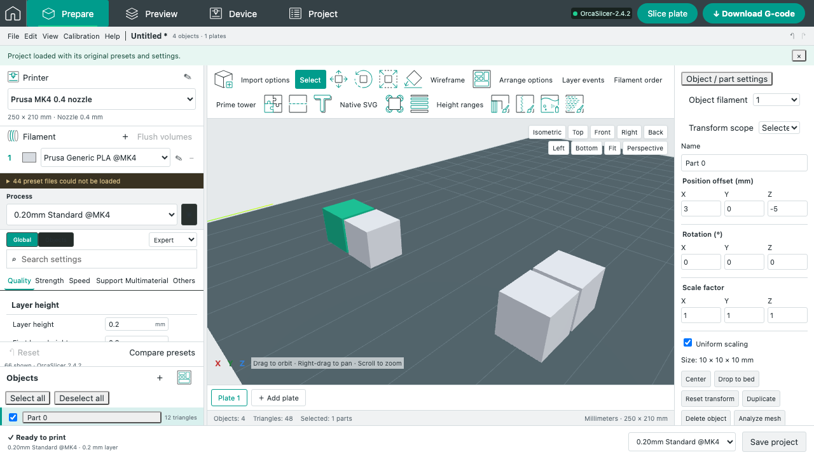

# Linked native instance edits

Baseline: OrcaSlicer **2.4.2**, source `8500fcdccaa10b5099ac20d252af3a7c560046f1`. This follows Fill bed's explicit `native.instanceFamily` identity. Historical numeric object/instance IDs are not treated as a link: native Clone creates independent ModelObjects.

## Implemented behavior

A central immutable project transaction reconciles edits before the history snapshot and generated-path guard. Object/part settings, names, filament assignment, roles, painting, height ranges/profiles, brim ears, native text/SVG regeneration metadata and source geometry remain shared across a ModelObject's instances. Part translation/rotation/scale changes the common volume transform; each peer retains its own instance frame. Adding/removing a part propagates membership, while deleting a whole instance removes only that instance. Explicit topology replacements invalidate old indexed source carriers and propagate the actual replacement surface.

The native `Selection::synchronize_unselected_instances` rule is retained: tilt/scale/mirror synchronizes the peer linear matrix as `oldPeer × inverse(oldSelected) × currentSelected`, retaining peer XY placement. Pure world-Z rotation and translation keep the peer linear matrix. Peer Z synchronizes only when its native `auto_drop` is false and the printer is FFF. That build-item flag now survives native/JSON import, server validation and export. No independent bed-placement behavior is inferred from this flag.

Shared volumes retain indexed native vertices and components. The browser representation and text/brim coordinate frames are remapped into each peer's frame; stale source metadata still rejects. Paint winding is instance-dependent and is excluded from shared-volume identity, while the paint tree remains shared. Nonconflicting edits to different volumes merge. Conflicting edits of the same volume fail atomically with guidance; no peer wins silently. Local visibility/printability remain local.

Independent object duplicate and new Cut outputs no longer inherit an old instance token. Those lifecycle fixes were delivered separately before this package. They do not imply native multi-instance Cut support.

## Evidence

- **17 new unit tests**, **51 focused units including existing Fill/Cut/brim/generated-path checks**, all passed with zero skips.
- **Three retained browser checks** exercise rotated-peer part movement, one Undo/Redo step, native export, shared settings/name edits, and part versus instance deletion. The former explicit linked-Cut limitation is superseded by the [native linked Cut follow-up](NATIVE_LINKED_CUT.md).
- **One real native browser check** exports one ModelObject with two build instances, reimports four volumes and slices both instances into **50 layers** using installed OrcaSlicer 2.4.2.
- **Native archive differentials** apply a part transform and seven-wall override to rotated and mirrored linked instances. An independent reference edits only the native component matrix and part XML; every native-read archive entry is byte-identical. The translation-only version additionally runs a fixed reference/reference/web/web sequence: **all four runs produce exactly the same 11,057 normalized motion commands**. Any differing run fails; no retry or matching-run selection is used. Classic walls, rectilinear infill and disabled layer-cooling slowdown are explicit fixture constraints.
- The unchanged pinned C++ `Selection::synchronize_unselected_instances` method was compiled with Eigen and a minimal GUI ownership shim. Six independent cases, each with both auto-drop states, cover XY/Z movement, Z rotation, tilt, nonuniform scale, mirror and SLA. JavaScript matrices agree within `1e-12`. The source method SHA256 is pinned in `tests/fixtures/native-instance-reference.json`.

The initial rotated classic-wall comparison matched 11,072 commands, but the integrated rerun produced 11,122 commands from the same web archive, first clipping an upper-layer corner at Z8.8. A fixed four-run follow-up (reference twice, web twice) then produced 11,072 commands in every run. The saved failing web input and both subsequent web controls have identical input hashes. This establishes a native same-input repeatability failure; its underlying native cause remains unresolved. The rotated and mirrored archive assertions remain strict, but rotated native motions are **not** claimed deterministic. The [repeatability record](native-instance-repeatability.json) and [complete compressed inputs/outputs](native-instance-repeatability.zip) preserve the failure and all four controls. The current exact-motion test is deliberately scoped to translation-only linked instances.

The default Arachne/cooling probe did **not** produce exact repeated motions despite identical native-read archive entries. One run changed integer feed rates; another changed paths. [Retained evidence](native-instance-default-probe.json) records hashes and first differences. The installed CLI also rejects `--threads`. This is an unresolved native determinism boundary, not a passing default-profile differential. Raw probe archives/G-code remain in the isolated stage's `evidence/default-arachne-probe` directory.

## Remaining scope

Linked Cut now uses the [original native reset and bed-placement implementation](NATIVE_LINKED_CUT.md), with separate source, unit, API, browser and native acceptance evidence. Its remaining interactive and topology-preservation boundaries are recorded there. Independent clones retain their existing Cut behavior. Cross-object regrouping, simultaneous conflicting edits of the same shared volume, and full GUI transform/automatic-bed-placement parity remain unverified. This milestone does not certify all native instance workflows or visual equality.

## Reproduce

Run `node --test tests/unit/native-instance-edits.test.js`, `node --test tests/native/native-instance-edits.test.js`, and the two `native-instance-edits.spec.js` browser files using the repository's mock and native Playwright configurations. Native tests require the installed 2.4.2 executable and native configuration helper.

For the source oracle, run `python3 scripts/build-instance-reference.py --source <pinned-Orca-source> --eigen <Eigen-headers> --output .reference`, then `node scripts/generate-instance-reference.mjs`. The builder rejects a different method hash. The oracle uses Orca's AGPL-3.0-only source and Eigen's existing dependency license; it is a test reference, not a shipped runtime service.

## Later M20 regression evidence

The final full native run also exposed translation-only same-input variability: fixed web runs2/3 read identical input SHA256 but produced11,223/11,057 motion commands. The repeated-input assertion remains failing; translation-only determinism is no longer a supported claim. [Metadata](native-instance-translation-repeatability.json) and [complete original files](native-instance-translation-repeatability.zip) preserve all four runs. Native-readable archive equality is still exact.
