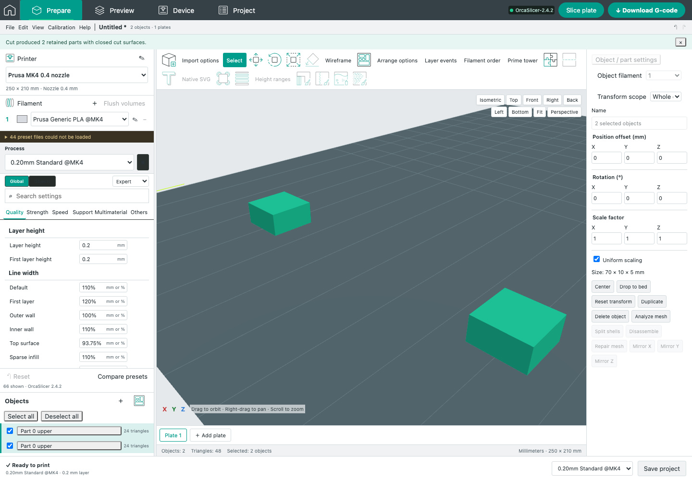

# Linked native Cut

Baseline: OrcaSlicer **2.4.2**, revision `8500fcdccaa10b5099ac20d252af3a7c560046f1`. This extends the explicit ModelObject instance families introduced by Fill bed and shared editing. It does not certify all native Cut behavior or GUI pixel equality.

## Behavior

Cutting one linked instance replaces every instance of the same native ModelObject. Each retained side becomes a new shared ModelObject family; processed plug/hole parts, dowels, dovetail fragments, volume roles and cut relationship IDs remain attached to the correct family. Unrelated ModelObjects remain independent, even when they belong to the same connector cut relationship. Existing independent-object Cut behavior is unchanged.

The native helper executes the **unchanged `CutUtils.cpp::reset_instance_transformation` body** and the original `ModelObject::ensure_on_bed(false)`. The selected instance's transformed geometry is baked once. Native SVD/Euler/mirroring rules remove scale and tilt from output instance frames, retain peer XY offsets and peer Z rotation, and apply the upper/lower place-on-cut and flip flags. Lower place-on-cut also implies native flip. Dowels use the native identity cut frame and restore their centered geometry before native placement; reusing the old already-grounded preview would be wrong when `auto_drop=false`.

The original bed-placement behavior is retained exactly: `ModelObject::min_z()` derives its cached height from the first instance, and `ensure_on_bed(false)` applies the same Z offset only to instances with `auto_drop=true`. It does not independently drop every peer. Tests explicitly cover first-instance and all-instance auto-drop-disabled cases. Native per-plate global offsets are used by the helper and converted back to local plate coordinates for the browser.

The existing geometry algorithms still create the closed planar/connector/dovetail surfaces. Their native instance placement is now available through `POST /api/geometry/instance-cut`. The helper receives bounded geometry and frames, with no request file paths or printer interaction. Limits include 256 instances, 130 retained results, 500,000 source vertices/triangles, two million expanded triangles and 64 MiB JSON. It shares the existing bounded native queue, total deadline, stdout/stderr limits, cancellation and temporary-file cleanup. Unexpected identity, frame, membership or auto-drop changes reject before a project mutation.

The dialog previews all peers on the active plate, exposes native placement flags, and requires the existing painting/text metadata-loss consent. Cancel aborts pending work and commits nothing. Apply is one Undo entry and selects all new retained groups on the active plate. All bound plates are updated; selection remains within the browser's current active-plate constraint. Arrange is a separate explicit operation, matching the fact that native Cut's automatic Arrange call is commented out.

## Verification

- **Nine new unit tests**, **28 focused unit/transport tests** including existing instance synchronization checks: immutable family replacement, analytic bounds, native/JSON roundtrip, connector identity, plate origins, auto-drop, centered dowels, response validation and oversized-load rejection.
- **Three API checks**: worker admission, wrong-operation rejection, disconnect cancellation, shutdown and unavailable-helper errors.
- **Four native checks**: exact source-frame reference, hostile input rejection, actual installed slicing and linked dovetail roundtrip. Eleven independently compiled original-C++ cases cover selected second instance, tilt/scale/mirror, oblique placement, both flip flags, one retained side, two plates, dowels and plugs. Every matrix and native height diagnostic matches exactly.
- **Three new browser checks**, plus **ten retained Cut/shared-edit browser regressions**: real UI submission, selection, consent, one Undo/Redo, export, cancellation and failure behavior. The independent cut-family fixture was refreshed from the already-integrated identity correction; its assertions were preserved.
- **One real native browser check** exercises the production endpoint and helper, native archive export/reimport, Undo/Redo and installed 2.4.2 slicing. One retained upper ModelObject has two build items and produces **25 layers at both expected footprints**. The screenshot below is from that run.
- Native helper build and Vite build pass. No skipped checks are counted as passes.

The C++ reference is generated separately from the production dispatcher. It compiles the original pinned reset method with the real Model implementation. Its reset method SHA256 is `944f4f4256b644ab1778217f42b63326cc8db13a5be9e5062f848163f5b1019e`. Inputs and exact outputs are retained in `tests/fixtures/native-instance-cut-reference.json`; analytic unit expectations additionally check the horizontal geometry and placement without deriving expected coordinates from the production result.

## Remaining boundaries

Keep-as-parts is not exposed by this workflow. Native topology-aware painting restoration and the full native interactive cut gizmo remain outside this change; explicit loss consent is retained. Objects large enough to trigger native's interactive scale-down prompt reject with guidance instead of guessing a scaling decision. All-plate scene selection, native volume-list ordering, physical print results and exact GUI visual equality remain unverified. This change proves native reset and bed-placement semantics for the tested inputs, not equality of every native cap triangulation or arbitrary native toolpath. The separate rotated same-input slicer repeatability issue remains documented in `native-instance-repeatability.json`.

## Reproduce

Build the helper with `npm run build:native:arrange`; its binary and `build-manifest.json` must be deployed together. Run `node --test tests/unit/native-instance-cut.test.js`, `node --test tests/integration/native-instance-cut.test.js`, and `node --test tests/native/native-instance-cut.test.js`. Browser files are `tests/e2e/native-instance-cut.spec.js` and `tests/native-e2e/native-instance-cut.spec.js` under their normal repository configurations.

To regenerate the independent source reference, run `python3 native/arrange-worker/scripts/build-instance-cut-reference.py --source <pinned-Orca-source> --build native/build/arrange --output .reference-cut`, then `node scripts/generate-instance-cut-reference.mjs`. The source hash is verified before extraction. The worker and oracle use the existing pinned dependency cache and licenses; new native source adapters are AGPL-3.0-only. No new external dependency is introduced.
