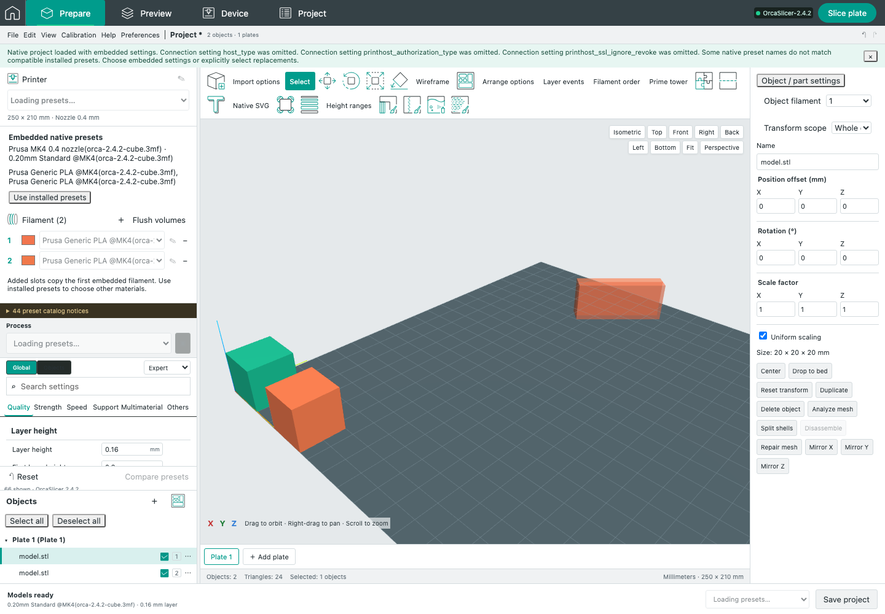

# Native pre-slice prime tower

Baseline: OrcaSlicer 2.4.2, source `8500fcdccaa10b5099ac20d252af3a7c560046f1`.

Prepare now requests the native estimated tower for the current complete project. The service resolves native preset values and validates geometry, assignments, painting, height ranges, plate metadata and tool changes. The browser cannot provide trusted containment, tool counts or tower dimensions. The existing bounded geometry worker owns its queue, process deadline, temporary files and cancellation.

The helper builds native Model families and instances in project order. Original `PartPlate::check_outside`, `contain_instance_totally`, `printable_instance_size` and `get_extruders(true)` determine membership and tools. Original `estimate_wipe_tower_size` and `WipeTower` height limits calculate the dimensions. The source extraction changes the GUI class qualifier and replaces application-owned configuration providers with explicit request-owned values.

`GLCanvas3D.cpp` 2845–2910 defines the pre-slice visibility gates. `3DScene.cpp` 832–886 renders a translucent cuboid split into one band per used filament. The web renderer preserves the native Float32 dimensions, band arithmetic, cube triangle order, 0.66f opacity, per-plate placement and rotation. Fit includes the visible tower. Empty, disabled and ineligible towers have no geometry. Failed or obsolete requests remove their geometry rather than leaving a stale footprint.

## Native semantics retained

- Linked ModelObject instances keep insertion order, even when interleaved across plates. The collector and estimator check instance zero; the estimator then uses the native object's bounding box across all its instances.
- A sequential plate allows the tower only with exactly one printable contained instance. Nonprintable instances still affect the native collector where the original source does so.
- Exclusion regions use each completed group of four points. The native default single-point sentinel and any incomplete trailing group create no exclusion box.
- Sinking geometry uses original BuildVolume checks. Native non-sinking bounds and the sinking exclusion limitation remain unchanged; these are not claimed to be improved collision rules.
- Facet data is parsed in ascending triangle order and touched after loading, as in the original 3MF loader. Native cached tool assignments therefore see painted colors. Malformed/truncated trees, excessive depth, invalid palette IDs and invalid geometry are rejected before the native readers.
- Negative extra rib length remains valid. Native sizing, support assignments, height ranges, nozzle count, smooth timelapse and wrapping detection retain their original meaning.

## Independent evidence

[`build-prime-tower-reference.py`](../../scripts/reference/build-prime-tower-reference.py) independently extracts the original PartPlate methods into a fixture-owned class. It excludes the production tower parser, adapter and generated tower method object from the reference link. The general source-pinned Model, BuildVolume, TriangleMesh and WipeTower kernel remains shared. Visibility gates are a source-reviewed port, not a linked desktop GLCanvas. Reference geometry uses original `make_cube` and translation to record exact color-band vertices.

The frozen reference includes source hashes, generator/source/binary hashes and 27 cases: visibility settings, sequential/nonprintable objects, outside/overheight/exclusion geometry, sinking and nonrectangular beds, first-instance ownership, remote-instance height, painting, support/ranges/events, rib sizing, dual nozzles, Float32 placement, empty models and exclusion sentinels. Native tests compare every numerical result exactly. Unit tests compare all band vertices and triangle order exactly.

The initial independent reference omitted the loader's facet timestamp update; a reused native tool cache exposed that omission. Both loaders now perform the original invalidation. A real browser import also exposed the native single-point exclusion sentinel; a reference case now protects it. Neither discovery weakened comparison tolerances.

## Remaining work

This feature remains **partial**. Tower selection and drag/rotation gizmos, native desktop visual acceptance, post-slice real tower meshes in Prepare, full collision behavior and actual post-slice footprints are not yet complete. The pre-slice Fill and Arrange obstacle is covered by [M27 source evidence](NATIVE_FILL_TOWER.md). The material and lighting are not certified pixel-identical to native OpenGL. Current browser preparation supports the existing validated project/settings subset and has explicit geometry limits. A missing helper is reported; no substitute sizing formula is used.

The Mac remained locked during this milestone's native UI check. The screenshot below is the web viewport backed by the installed native project/configuration pipeline, not a desktop OrcaSlicer capture. No printer was contacted and no physical print began.

[M28 camera fitting](NATIVE_CAMERA_FIT.md) retains a requested view until current tower geometry completes and cancels it on later camera gestures, errors, disabling and plate changes. This resolves the M27 delayed-Fit clipping regression; native desktop visual parity remains open.
