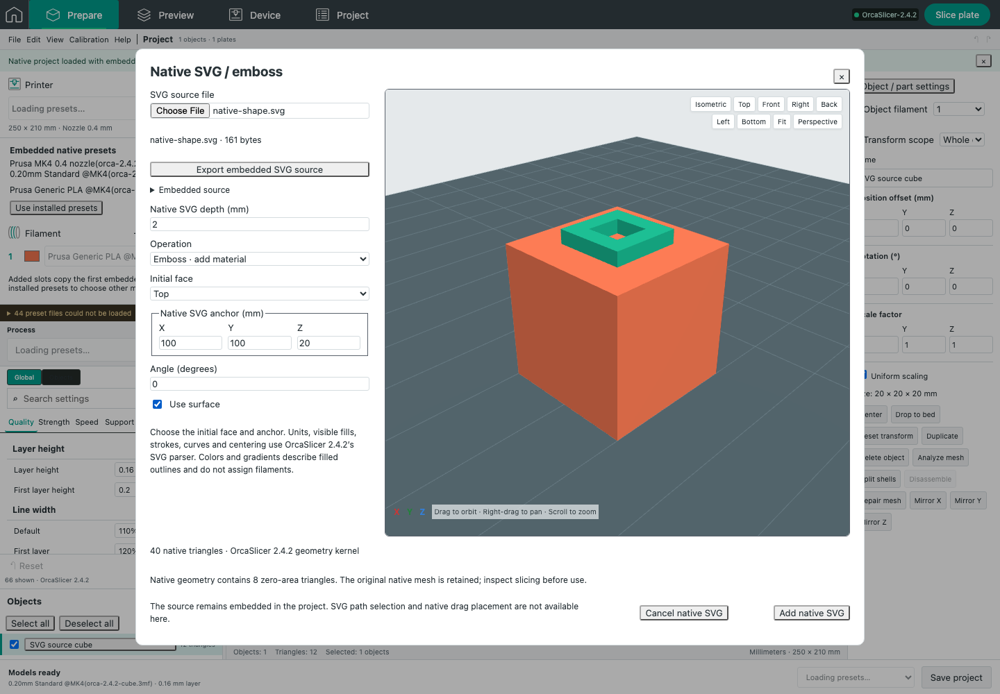

# Native SVG generation and regeneration

The Native SVG tool generates editable native embossed shapes using the pinned OrcaSlicer **2.4.2** source (`8500fcdccaa10b5099ac20d252af3a7c560046f1`). It supports standalone shapes, added normal parts, negative volumes and modifier volumes, plus native Use surface projection. Imported embedded SVG shapes can be regenerated or have their source replaced. Existing general SVG model import remains unchanged.

The helper compiles the unmodified native NanoSVG parser and `NSVGUtils.cpp`. It uses millimetres at 96 dpi, native fill rules, stroke caps/joins/dashes, curve tessellation, healing, centering and union. The adapter follows `GLGizmoSVG.cpp`’s 0.1 mm squared tessellation tolerance, including current world XY scale, float storage and the near-unit squared-norm tolerance. Planar extrusion and surface projection reuse the actual native Emboss/CGAL paths, including the 0.015 mm overlap. SVG’s native creation depth defaults to 10 mm. No substitute browser triangulator or default placeholder geometry is used.

`native/emboss-worker/svg-source-manifest.json` records source hashes for NanoSVG, NSVGUtils, EmbossShape and the native GUI/job orchestration. CMake checks those hashes and the pinned clean source checkout. The existing `npm run build:native:emboss` recipe builds the extended helper; no new dependency installation is required. Orca’s AGPL-3.0 and NanoSVG’s embedded zlib license remain with the pinned sources.

## Local source and lifecycle

The helper receives embedded source bytes through `--svg`; it does not resolve a font or accept a filesystem path. `/api/native-text/svg/generate` uses the same bounded queue, process lifecycle, total deadline, cancellation, stdout/stderr and memory/CPU safeguards as text. The capability response includes `svg: true` only when the binary advertises that supported mode.

Limits include 2 MiB UTF-8 source, 4,096 parsed shapes, 20,000 parsed curve points, 200,000 tessellated outline points, bounded coordinates and existing source/output mesh limits. Active or external content is rejected. Text, images, use references, masks, clipping paths and filters must be converted to self-contained paths before regeneration; the editor does not silently omit them. Colors and gradients describe geometry and do not assign filaments.

Source bytes/name, native frame, depth, surface flag and precision mesh carrier survive web JSON and native 3MF export/import. The source can also be downloaded unchanged. Ordinary transforms remain applied when a shape is regenerated. Opening and closing with unchanged source/settings preserves the original geometry, painting and undo history and submits no worker job. Explicit regeneration is separate. Changing triangles requires explicit consent before clearing the part’s support, seam, color or fuzzy painting; undo restores the previous state. Stale or canceled results cannot be applied to changed controls or object state.

## Verification

The focused suite passes **35 unit/contract/metadata checks**, **11 native checks**, **12 browser checks**, and **1 real native-helper browser acceptance**, with no skips. The 11 native checks include four SVG cases and existing native planar/per-glyph regressions; the 12 browser checks include four SVG cases and eight existing native text cases. A further focused five-test unit rerun covers source-defined near-unit and float XY tessellation scale. Native CMake configure/build and the web build pass.

Independent analytic fixtures verify mm/inch/96 dpi dimensions, even-odd holes, closed volumes, butt/square/round stroke caps, dashes and curved outlines. A 20 × 10 × 2 mm planar rectangle yields 399.9998502060906 mm³, and a square ring with expected 600 mm³ yields 599.9997753091358 mm³. These small differences follow native float coordinates; the implementation does not snap them to ideal dimensions.

A real surface ring is created on a 20 mm cube, regenerated from 1 to 2 mm depth, saved through both project formats and sliced by the installed 2.4.2 executable. It produces **920 raised XY deposition moves**, none in its central hole, and a maximum deposited Z of **21.96 mm**. Exported native source bytes are exact. The real browser additionally imports the native export and regenerates it again. Existing exact planar text acceptance remains unchanged.

### Native degenerate-face observation

The deliberately axis-aligned ring intersects the source cube’s diagonal at coincident vertices. Pinned CutSurface emits 20 indexed vertices (16 unique coordinates), 40 triangles and **8 exactly zero-area faces**. Native `TriangleMesh` construction computes statistics but does not remove these faces. This was initially exposed by a failed manifold assertion; the original output and diagnostic script are retained in the stage’s research artifacts.

The implementation preserves the native mesh and shows an explicit diagnostic. The regression checks the observed eight faces, zero boundary/non-manifold edges after coordinate welding, independent ring volume `75 × 2.015` mm³, embedded-source/frame retention and actual hollow native deposition. It does not claim this raw mesh is manifold, silently discard faces or hide the failed probe.

## Remaining parity scope

A captured installed-GUI SVG generation/regeneration comparison is still pending desktop access. Exact mouse surface-drag placement, selectable SVG subpaths, native style management and whole-UI pixel equality are not claimed. Initial face/anchor/angle controls provide explicit placement. The separately documented native surface-text triangulation variability remains open and is not closed by these SVG checks. Physical printing is untested.
