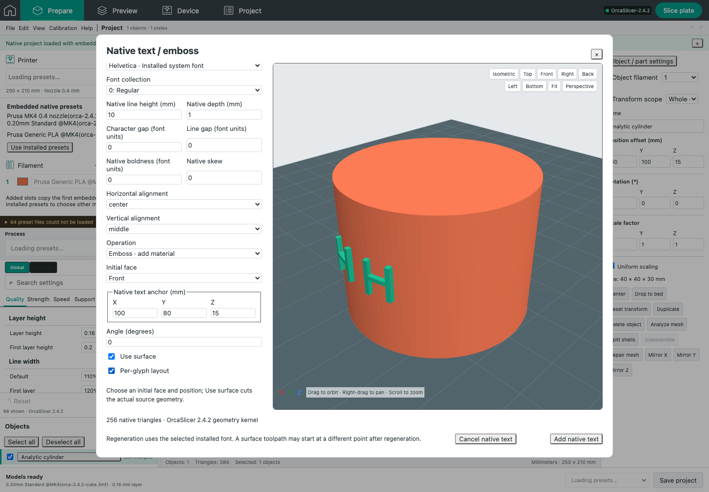

# Native text creation and per-glyph layout

This extends the OrcaSlicer **2.4.2 / 8500fcdccaa10b5099ac20d252af3a7c560046f1** geometry worker introduced in [NATIVE_EMBOSS_WORKER.md](NATIVE_EMBOSS_WORKER.md). It is implemented and tested within the scope below; it does not certify complete native text-tool or UI parity.

## Implemented behavior

The Text tool creates new native text with the installed/bundled font catalog, collection index, native ascent-based line height, depth, character/line spacing, font-unit boldness, skew and native alignment. It creates a standalone object, added normal part, negative volume or modifier volume. Initial placement is explicit: choose a face, adjust the anchor and angle. Native text configuration, the canonical regeneration frame and the precision source mesh survive web JSON and native 3MF export. Existing projects containing the earlier browser text format retain their original editor.

Per-glyph layout uses the pinned native `TriangleMeshSlicer.cpp` cross-sections. The GUI orchestration from `TextLines.cpp` calculates font-dependent line centers, retries the text-origin slice when a line misses the object, unions contours and chooses the contour closest to the text origin. The existing native `Emboss::sample_slice` places glyph centers along that contour; `calculate_angles` uses the native ±5 mm tangent samples. `EmbossJob.cpp` then places individually extruded glyphs or invokes the actual CGAL `CutSurface` engine for each glyph when Use surface is enabled. This is not a generic projection or substitute text triangulator.

The worker bounds per-glyph requests to 128 lines and retains the existing source/triangle/byte, queue, deadline, cancellation, CPU and sampled-resident-memory limits. A missing cross-section fails with an actionable placement error rather than silently falling back to flat text. Standalone text cannot use surface/per-glyph modes because it has no source object. Source meshes include the same object's normal parts; separate objects and negative/helper parts are excluded from regeneration.

Opening and closing the native text editor with unchanged effective values preserves the original geometry, painting and undo history and does not submit a geometry job. This follows the native distinction between opening the gizmo and its `process()` calls on changed controls. “Regenerate with current settings” requests an explicit regeneration. This no-op path does not replace or weaken the existing regeneration comparisons.

## Source and build provenance

- `src/slic3r/GUI/TextLines.cpp`: `select_closest_contour` and `TextLinesModel::init`; `TextLines.hpp`: ascent offset 1/3.
- `src/slic3r/GUI/Jobs/EmbossJob.cpp`: `create_line_bounds`, `create_mesh_per_glyph`, `cut_per_glyph_surface`, `CreateObjectJob` and normal/negative/modifier part selection.
- `src/libslic3r/Emboss.cpp`: native arclength sampling/tangents, font outlines, healing, triangulation and surface orientation; `SurfaceDrag.hpp`: suggested-up threshold 0.9.
- `native/emboss-worker/per-glyph-source-manifest.json` pins the source hashes. The build now compiles unmodified `TriangleMeshSlicer.cpp`, with hash-checked extraction of the native mesh-edge mapping helpers from `TriangleMesh.cpp` alongside the existing exact `its_merge` extraction.

The new orchestration files retain the native AGPL-3.0 license. No new dependency or global installation is introduced. `npm run build:native:emboss` rebuilds the worker through the existing pinned recipe. `--capabilities` advertises per-glyph support; an older helper can still provide planar/surface editing without falsely advertising the new feature. Rebuilding is explicit and never occurs on server startup.

## Evidence

The focused handoff checks include 31 unit/worker-contract/metadata checks, 9 native checks, 11 browser checks with mocked native API responses or legacy fonts, and 2 browser checks using the actual helper and installed OrcaSlicer 2.4.2. No checks are skipped. Native regressions retain the **13,743 exact normalized planar GUI motion commands**.

An independent regular 96-sided cylinder fixture verifies two closed glyph components. Surface output remains inside the analytically derived radial envelope `20*cos(pi/96)-0.015 … 21` mm for a 20 mm cylinder and 1 mm emboss depth. Individual planar glyphs remain tangent planes and can exceed that envelope, as expected. Common rigid transforms retain local layout; missing sections and excessive line counts reject. Production-service preparation, JSON/native export and re-import retain per-glyph metadata; actual slicing produces hundreds of raised outer-wall moves beyond the cylinder's base radius. CGAL triangle counts vary with valid cap triangulation and are not used as an exact-equivalence shortcut.

Tests: `tests/unit/native-text-creation.test.js`, `tests/unit/native-emboss-regeneration.test.js`, `tests/unit/native-emboss-worker.test.js`, `tests/native/native-per-glyph.test.js`, existing native text/metadata regressions, `tests/e2e/native-text.spec.js`, `tests/e2e/text.spec.js`, and `tests/native-e2e/native-text.spec.js`. The legacy browser checks now import existing legacy projects, because new text creation uses the native helper. The real browser screenshot below verifies actual curved glyphs and keeps the Apply footer visible while the controls scroll.

## Exact surface comparison remains unresolved

The original captured GUI fixture is unchanged. Controlled independent archive experiments preserve its original mesh transforms and native settings while replacing only cap triangulation or only regenerated vertex coordinates. The six stale preset-compatibility fields already documented for the original GUI reference are the only settings removed.

| Changed mesh data | Motion count | First differing command, zero-based |
| --- | ---: | --- |
| Cap triangulation only | 12,030 | 10,979: `G1 X105.319 Y111.798 Z20.6 F18000` → `G1 X105.396 Y111.85 Z20.6 F18000` |
| Coordinates only | 12,030 | 11,337: `G1 X110.055 Y105.839 E.01681` → `G1 X110.054 Y105.838 E.01678` |
| Both | 12,030 | Same first difference as triangulation-only |

Thus the first observed difference is reproduced by CGAL cap topology alone, and sub-micron regenerated coordinates independently alter a later rounded move. This excludes preset drift and the web-export placement transform as explanations for these particular differences. It does **not** establish identical surface toolpaths. The saved-coordinate vertex correspondence, oriented cap boundaries and covered-area tests remain separate evidence. The next independent check is native GUI reapplication using the same font and settings when desktop access is available.

## Remaining scope

A captured GUI per-glyph regeneration comparison, native mouse surface-drag/placement gizmos, saved style management and SVG regeneration remain unverified or incomplete. Explicit face/anchor placement does not claim to reproduce the GUI's camera-ray placement. System-font availability and native GUI regeneration after export still require a compatible installed font. Physical printing is untested. Exact whole-UI appearance and complete native text-feature parity are not claimed.
