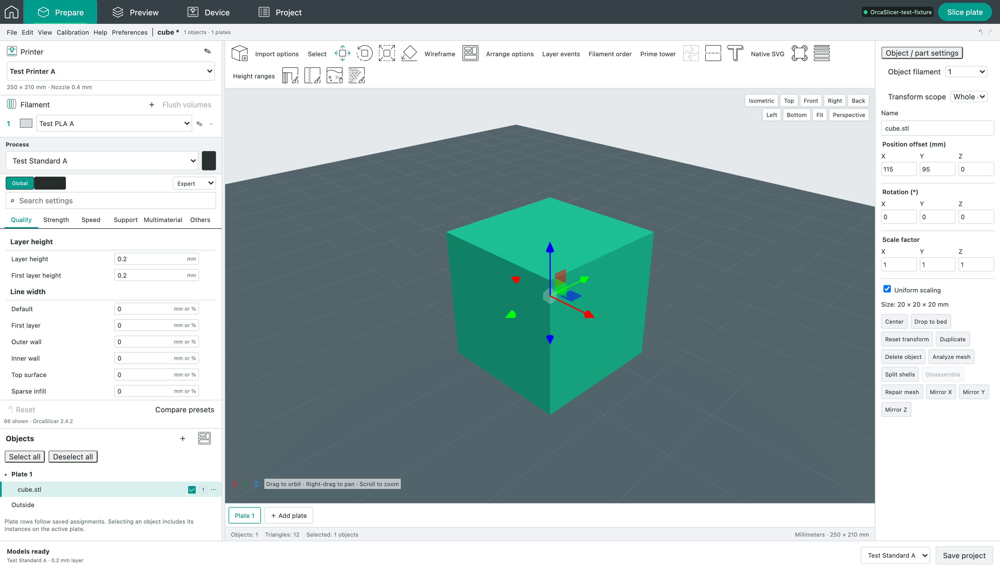
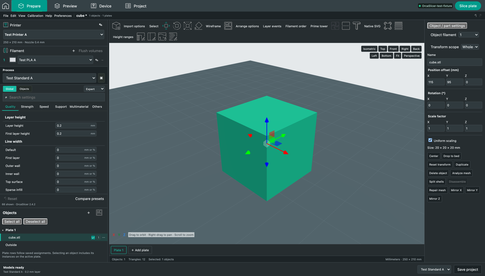

# Native toolbar icon states

Baseline: OrcaSlicer 2.4.2, pinned source `8500fcdccaa10b5099ac20d252af3a7c560046f1`.

Native `GLGizmosManager::generate_icons_texture` uses monochrome activable icons, colored hover/selected icons and explicit disabled colors. `GLTexture::load_from_svg_files_as_sprites_array` performs this conversion after NanoSVG rasterization. The web previously showed the colored source SVG in every state, faded disabled buttons with opacity and painted selected buttons green, obscuring their green arrows.

The web now uses exact native raster output for 15 toolbar icons in light/dark themes at 36/72 pixels. Native source SVG files are unchanged. Selected and hovered tools retain the toolbar background; disabled tools use the native raster color at full opacity. Disabled hover cannot reveal an enabled state. Non-toolbar icons keep their existing behavior.

`scripts/reference/build-toolbar-icons.py` extracts and compiles the original complete raster method with the original NanoSVG headers. Minimal GUI/OpenGL boundary stubs provide theme state and capture the uploaded RGBA texture. The original state array determines normal, hover, selected and disabled images. The generator crops those native atlas tiles into four-state strips without changing pixels; CSS selects the proper tile. Retina images use srcset. Source method, support source files, input SVGs, generator, reference translation unit, executable and all RGBA/PNG outputs have recorded SHA-256 hashes in `public/native-toolbar-icons/manifest.json`. The reference translation unit is checked in as `tests/fixtures/native-toolbar-reference.cpp`. No production helper changes are required.

Seven unit checks verify pinned provenance, every strip pixel against its native atlas in both resolutions/themes, native Move colors and alpha preservation. Four browser scenarios compare actual rendered Move pixels through disabled, disabled-hover, normal, hover, selected, selected-hover and deselection transitions in both themes and densities. The comparison permits only a per-channel difference of 3 for browser compositing, with zero pixels exceeding it. The existing native-layout check also passes. [Unit](M35_TOOLBAR_UNIT.log), [five browser checks at the standard 1280×720 viewport](M35_TOOLBAR_BROWSER.log), [same five checks at 1759×1002](M35_TOOLBAR_LARGE_BROWSER.log).

The screenshot harness aligns icon layout to whole CSS pixels solely to exclude fractional clipping from the state comparison. An initial locator screenshot rounded a 36-pixel box to37 pixels; a later test-only CSS transform introduced resampling blur. Those harness defects were corrected using an exact screenshot rectangle and relative layout positioning. No production raster, screenshot tolerance or native color was altered to absorb the difference. Baseline SVG rendering still differed at207/672 light-theme pixels and203/668 dark-theme pixels under the earlier aligned harness. All failed runs and traces are retained in [diagnostics](M35_TOOLBAR_DIAGNOSTICS.zip).

## Test-boundary reliability

The first full unit run was1062 passed,1 failed. An existing G-code worker test combined input/result/console size checks and stalled-process behavior under the same150 ms deadline. On the LARGE output case, identification/process startup reached that deadline before the output-size assertion. [Original failure](M35_UNIT_INITIAL_FAILURE.log).

The test now checks byte limits with a5-second execution budget and tests the unchanged150 ms stalled-process deadline separately after explicit identity warmup. Byte limits, expected error messages, cleanup checks, actual runtime deadlines and production code are unchanged. The focused5-case worker file passes and the revised full suite passes1064 checks. This is a changed test with retained prior failure, not a rerun until the old test passed. [Focused worker log](M35_WORKER_LIMITS.log).

These checks establish toolbar state pixels at the recorded sizes. Overall native spacing, complete tool availability and arrangement, other theme surfaces, fractional/rescaled presentation and a fresh paired desktop capture remain unverified. Native desktop access is currently locked. No complete UI parity claim is made.
