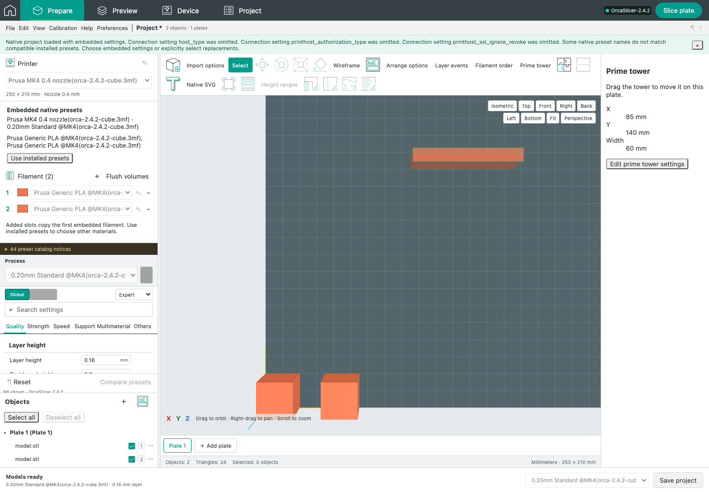

# Native prime tower body dragging

Baseline: installed OrcaSlicer 2.4.2 and source `8500fcdccaa10b5099ac20d252af3a7c560046f1`.

Prepare now supports selecting the prime tower shell and dragging it in the build plane. Releasing commits one project edit; Escape or pointer cancellation restores the starting position without an Undo entry. Per-plate X/Y settings survive Undo/Redo, save and native export. Model geometry remains unchanged. A selected-tower inspector exposes its position, width and existing settings editor. Only Select/Move modes enable this body gesture.

## Independent native evidence

The helper returns the original `PartPlate::get_build_volume(true)` bounds, native world origin and brim-plus-0.5mm inset. JavaScript reproduces `Selection::translate` float conversion, scaled integer truncation, expression order, and `WipeTower::move_box_inside_box`. The original deliberately uses an unrotated shell bounding box, and applies no correction when either dimension is too large. These quirks are preserved.

The separate generator `scripts/reference/build-tower-drag-reference.py` compiles the original containment method directly, with extracted original PartPlate methods and original geometry types. Production tower-input parsing and the JavaScript constraint implementation are not used to produce expected values. The frozen C++ source and JSON fixtures record native source, generator, reference binary and geometry kernel hashes.

All 186 displacements across 26 cases match exactly: ordinary and fractional brim values, shared-extruder regions, rotated shells, oversized dimensions, remote/fractional world origins, edge crossings and tiny movement. An initial regrouped expression produced five tiny remote-origin mismatches; matching the native operation order fixed them without adding a tolerance. The native worker separately matches all 26 context/geometry results, with a provenance assertion for its built adapter and binary.

Native `GLCanvas3D` supplies the gesture contract: first selection requires more than five pixels on either axis; subsequent selected movement has no threshold. Dragging intersects the original hit-height plane; nearly horizontal views use camera-ray projection. Native `load_wipe_tower_preview` uses one full shell for picking, so the browser uses a separate raycast shell rather than internal color-band faces. A legacy helper without drag context keeps its visible tower and disables body dragging.

## Browser and installed-slicer checks

- 55 focused unit/native checks pass: 28 unit checks and 27 native checks.
- Eight browser checks pass: normal movement with one history entry, other plate/model preservation, Escape, pointer cancellation, native edge inset with fixed camera, unavailable legacy context, stable viewport from no selection, orthographic dragging, and native selection threshold (several checks cover multiple assertions).
- One real browser/native workflow passes: two-material native project import, pointer movement, Undo/Redo, native 3MF export and installed-native slicing with actual prime/wipe extrusions.

[Focused native/unit log](M32_TOWER_DRAG_FOCUSED.log), [browser log](M32_TOWER_DRAG_BROWSER.log), [installed-native browser log](M32_TOWER_DRAG_BROWSER_NATIVE.log).

## Failures retained and resolved

The diagnostic archive retains initial failures and the complete successful focused logs. The first browser run exposed an empty view-toolbar container intercepting the pointer; its empty area now passes pointer events to the canvas. Two test setup errors (button capitalization and an absent second plate) were corrected. Polling now handles the legitimate loading state.

Selection initially changed viewport dimensions during the gesture. Reserving the inspector layout until release prevents the width jump. Removing the object-only plate selector also changed canvas height by two pixels, causing a measurable world-coordinate error; consistent plate-control heights remove that shift. The browser fixture independently projects the actual pointer events through the recorded camera. It does not replace the native containment oracle. Camera preservation allows 1e-8mm for normal OrbitControls floating-point drift; all 186 native geometry comparisons remain exact.

One final focused run passed seven tests and failed initial page navigation with HTTP404 while a simultaneous Vite build replaced the served output. Its trace is retained. The identical browser suite passed all eight cases with a stable completed build. A native browser test initially waited on the wrong job endpoint despite a completed native slice; its corrected endpoint is `/api/jobs/project`.

[Development logs and build-overlap trace](M32_TOWER_DRAG_DIAGNOSTICS.zip). No retry-selected native fixture, weakened geometry tolerance, or claimed passing physical print is used.

## Remaining acceptance

This is body dragging, not complete prime-tower parity. Native X/Y move gizmo (rotation is disabled in the pinned native UI), exact native inspector/outline/lighting appearance, fresh paired desktop pointer captures, post-slice tower/brim/rib mesh and complete purge-dependent collision behavior remain open. Unexpected pointer capture loss, window interruption and asynchronous same-plate preview replacement during a gesture still need dedicated regression coverage. Full native slicing repeatability remains a separately recorded concern. No printer was contacted.

Full results and retained failures: [M32](MILESTONE_32.md).
