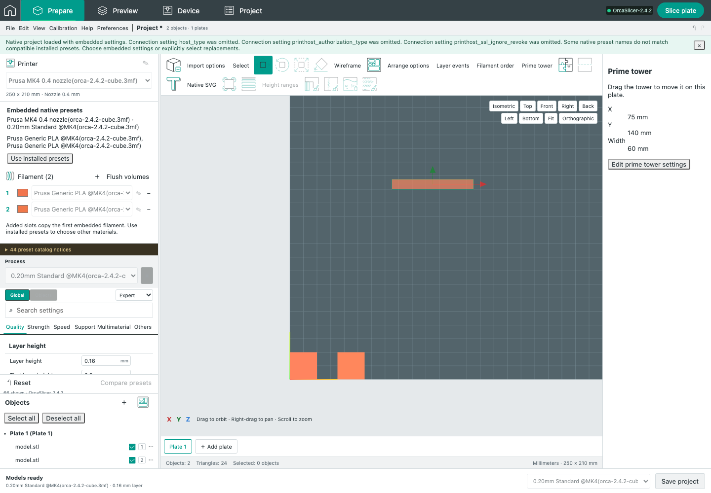

# Native X/Y prime-tower Move handles

Baseline: OrcaSlicer 2.4.2, pinned source `8500fcdccaa10b5099ac20d252af3a7c560046f1`.

Selecting the prime tower enables Move and its M shortcut. X/Y handles translate along the corresponding world axis, preserve the inactive axis and native shell dimensions, obey the existing native plate/brim clamp, support Shift snapping and commit one Undo transaction. Escape, lost capture and other interruption paths cancel temporary movement. Deselect All clears tower selection. Native Z translation handles, Rotate, Scale and Place on face remain unavailable for the tower.

The original `GLGizmoMove3D::calc_projection` projects the pointer ray onto the initial handle axis and applies C++ `std::round` when Shift is down, with a default 1 mm step. The independent compiled reference extracts this method, Move/Rotate/Scale activability and Move's axis enablement directly from the pinned source. Twenty-six cases exercise both axes, signed half-step rounding, perspective rays, distant origins and degenerate directions. Source, extracted method, generator and binary hashes are recorded in `tests/fixtures/native-tower-gizmo-reference.json`; the exact reference translation unit is retained alongside it. Projection agreement uses a 1e-10 mm floating-point tolerance; Shift results are exact. Existing M32 native clamp comparisons retain their unchanged exact assertions.

Focused validation: 28 projection/provenance/validation unit checks, 37 combined projection/interruption unit checks, 14 browser body/axis drag checks and 3 actual browser/native workflows pass. The native workflows separately exercise body, X and Y dragging, Undo/Redo, exported native 3MF coordinates and installed-engine slicing that contains actual prime-tower extrusion. [Unit](M34_GIZMO_UNIT.log), [interaction unit](M34_GIZMO_INTERRUPTION_UNIT.log), [browser](M34_GIZMO_BROWSER.log), [native browser](M34_GIZMO_NATIVE_BROWSER.log).

## Remaining limits and retained diagnostics

The web handle shape, size, colors and lighting are not a completed desktop visual comparison. Native desktop access remains locked. Initial browser tests exposed the camera-view buttons covering the handle at the default zoom. This usability defect remains open: the successful scenarios explicitly use the user's normal zoom control to expose the handle before dragging. No fit/frustum assertions or runtime camera bounds were relaxed. Initial run: 11 passes, 3 failures; an insufficient zoom still yielded 2 failures and 1 pass; the final focused run passes all 14 with explicit zoom. These are retained in [diagnostics](M34_GIZMO_DIAGNOSTICS.zip), along with the initial C++ harness syntax error and premature missing-fixture unit invocation. They are not counted as successful runs.

M32's strict native slicing-repeatability failures and M33's completed-job download connection reset remain historical unresolved evidence. Full visual parity, post-slice Prepare tower geometry, complete collision behavior and hardware acceptance remain incomplete. No printer was contacted.
