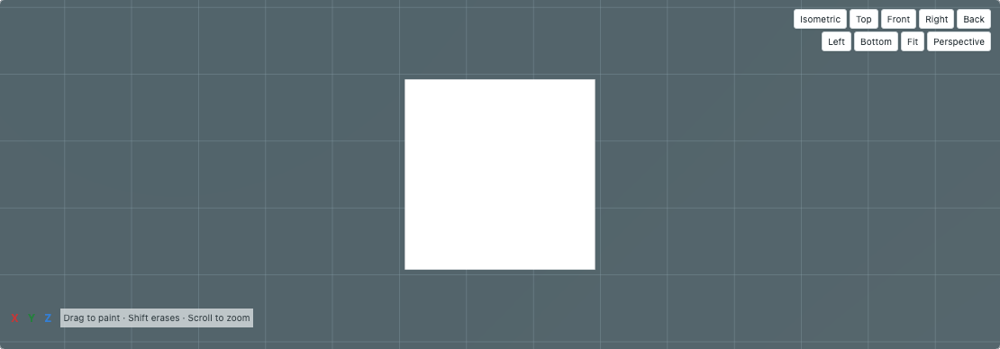
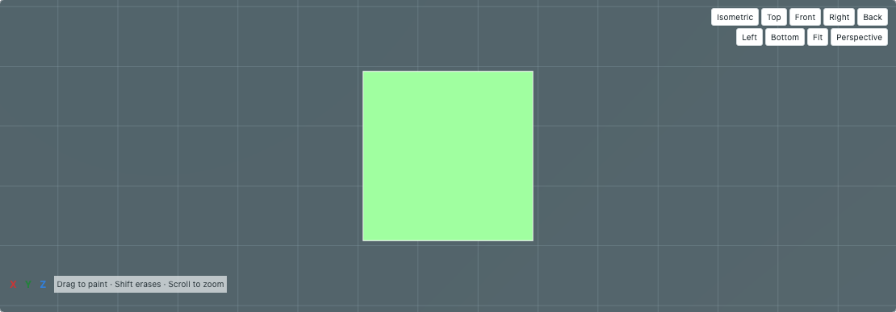
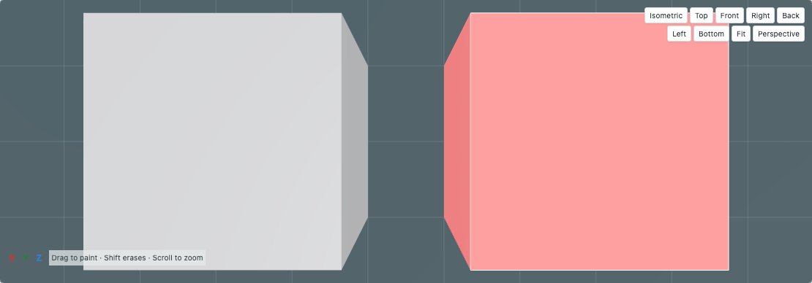
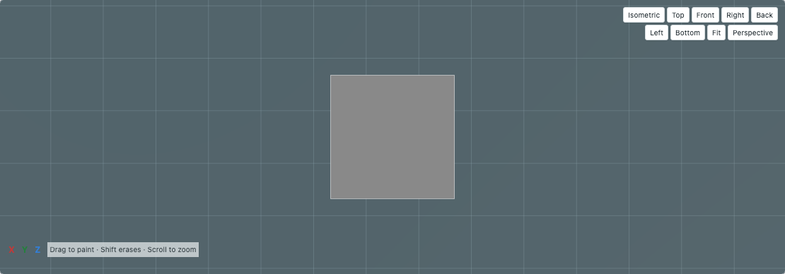

# Native fill-hover feedback

Baseline: OrcaSlicer **2.4.2**, pinned source revision `8500fcdccaa10b5099ac20d252af3a7c560046f1`. This adds source-backed smart-fill, bucket-fill and current-subfacet hover feedback. Native GUI pixel equality remains unverified.

## Native behavior inspected

- [GLGizmoPainterBase.cpp:895–964](https://github.com/OrcaSlicer/OrcaSlicer/blob/8500fcdccaa10b5099ac20d252af3a7c560046f1/src/slic3r/GUI/Gizmos/GLGizmoPainterBase.cpp#L895): hover computes smart-fill, bucket-fill or pointer selection from the current normal-volume ray hit, clears prior selections when the pointer leaves the model or moves to another volume, and uses the painter’s clipping/selection constraints.
- [GLGizmoPainterBase.cpp:1202–1240](https://github.com/OrcaSlicer/OrcaSlicer/blob/8500fcdccaa10b5099ac20d252af3a7c560046f1/src/slic3r/GUI/Gizmos/GLGizmoPainterBase.cpp#L1202): selected leaf colors retain their existing state and multiply each RGB component by 1.25, clamped to one; alpha is one.
- [GLGizmoPainterBase.cpp:1858–1900](https://github.com/OrcaSlicer/OrcaSlicer/blob/8500fcdccaa10b5099ac20d252af3a7c560046f1/src/slic3r/GUI/Gizmos/GLGizmoPainterBase.cpp#L1858): selected-region contour edges render white, with a small projection-depth offset.

These are code-inspection claims. No native GUI screenshot is asserted to match the web pixels, and no physical printing evidence is required or claimed for hover-only feedback.

## Implementation

`previewPaintFill` uses a `previewOnly` branch of the same `paintMesh` smart-fill/bucket/pointer traversal that applies a stroke. It does not apply the requested paint state, modify facet trees, normalize a result back into metadata or create a history entry. Smart-fill returns the existing painted leaves within its selected original facets; bucket and pointer return the selected same-state leaves. The public result contains geometric leaves and current state only.

`previewObjectFill` restricts selection to the actual hit visible normal part of the selected native object. Connected fill never joins adjacent normal volumes, unrelated objects, hidden volumes, helper parts or another plate. The dialog passes the same fill angle, bucket edge-detection choice, clipping plane and actual overhang-only restriction used by committed painting. Overhang display highlighting is a separate option and does not silently change the selection rule.

Boundary generation reuses the existing unequal-subedge connectivity graph. For each selected edge it subtracts the **union** of collinear shared intervals. A long original edge meeting multiple shorter leaves therefore has no false internal seam; if only half is covered, the uncovered half remains visible. World endpoints are interpolated from the existing selected geometry, with connectivity computed in its source coordinate space. The existing 200,000-leaf/connectivity limits remain bounded; ambiguous excessive connectivity fails visibly.

The renderer uses current leaf colors from the existing channel/filament palette, applies the native 1.25 clamp in display RGB and supplies explicit color-space conversion to Three. It draws an opaque-looking selected region and depth-tested white boundary. This reproduces the source rule within the web renderer; it does not certify native lighting or color-management pixel identity. Every replacement or clear disposes prior highlight geometry/materials.

Hover state includes the current mesh identity, hit volume/facet, selection options, clipping, filament colors and slot count. Pointer misses and tool/mode changes clear it. Changes to painting, angle, clipping or overhang restrictions recompute it without a paint click. Existing button, wheel, stroke constraints, undo and independent brim interactions remain unchanged.

## Evidence

- `tests/unit/paint-fill-preview.test.js`: **seven** new tests. Independent expected geometry is a 4×4 square built from differently subdivided triangles (perimeter16, no diagonal), a partial shared diagonal (only its uncovered half remains), and a rotated/nonuniformly scaled world rectangle (perimeter40). These expected boundaries are specified directly, not generated by the contour implementation.
- Selector tests use frozen input objects, known native facet codes, expected leaf states and committed-result comparisons; they cover smart fill, bucket, pointer, angle changes, clipping, overhangs, normal-part grouping, unchanged other metadata, exact RGB clamp and renderer disposal.
- **32/32 related unit/service checks passed**, including prior brush, native painting archive/validation, clipping, cursor and M22 input-interaction tests. These are automated code/service checks, not installed-engine slice tests.
- `tests/e2e/paint-fill-preview.spec.js`: **three** new browser checks cover hover-only no-history behavior, actual fill and undo, current-state colors, no internal diagonal, pointer/bucket transitions, edge detection, clipping caps, overhang-only restriction, misses and changing native normal-part hits. Existing painting counts remain unchanged on hover. Full-app test harness uses the fixture backend; generated native project geometry is imported for the group case.
- **8/8 related browser checks passed**, including existing circle/sphere/height cursors, left/right/Shift painting, modifier wheel, stroke constraints and grouped-object painting. Focused canvas screenshots below were visually inspected.
- Production build passed. No tests skipped. No printer contacted.

## Browser captures

The captures document the browser rendering. They are not a native GUI pixel-difference baseline. Broader native GUI rendering, very large interactive-model performance and platform-specific color/depth behavior remain unverified.
